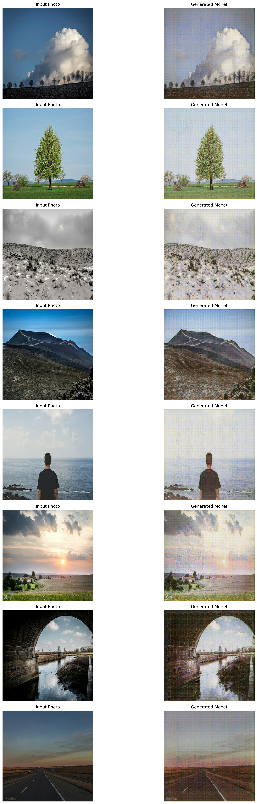

# 🎨 Monet Style Transfer

  

Transform your photos into stunning Monet-style paintings using the power of deep learning. Built with Next.js 14, Tensorflow and modern web technologies.

## ✨ Features

- 🖼️ Real-time photo to Monet style conversion
- 🚀 Modern, responsive UI using shadcn/ui components
- 📱 Works seamlessly on desktop and mobile devices
- ⚡ Powered by TensorFlow for model creation and training
- 🎯 High-quality style transfer that captures the essence of Monet's brushstroke
- ☁️ Hosted on AWS with EC2 and S3 Bucket
- 🐳 Containerized with Docker for easy deployment

## 📦 Tech Stack

### Web

- **Next.js 14**: React framework for building full-stack applications
- **Shadcn/ui**: Modern UI components for React applications
- **TailwindCSS**: Utility-first CSS framework for rapid styling
- **Bun**: Modern JavaScript bundler for building optimized bundles

### Model Creation & Training

- **Tensorflow**: Machine learning library for training and deploying models
- **Python**: Programming language for building the model and training pipeline
- **Numpy**: Library for numerical computing in Python
- **Pandas**: Library for data manipulation and analysis
- **Matplotlib**: Library for creating static, animated, and interactive visualizations in Python

### Fast API Server

- **AWS EC2**: Virtual server for hosting the application
- **AWS S3 Bucket**: Object storage for hosting static assets
- **Docker**: Containerization platform for packaging and deploying the application
- **Vercel**: Hosting platform for deploying web applications

## 📚 Documentation

The project's documentation is available at [docs](docs).

## 🌐 Web App

The web app is available [here](https://image-style-transfer-amber.vercel.app/).

## 📑 License

This project is licensed under the Apache License 2.0. See the [LICENSE](LICENSE) file for more details.

## 🚀 Examples

  
<strong>Click to view examples</strong>

  

    
  

